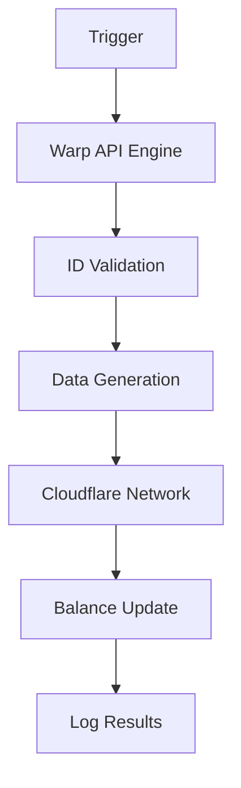

# 🌀 WARP-UNLIMITED-ADVANCED

<div align="center">
  
  
  
</div>

---

## 📖 Overview
**WARP-UNLIMITED-ADVANCED** is a high-performance automation suite designed to generate unlimited WARP+ data for Cloudflare WARP.



## ✨ Key Features
- ⚡ **High Speed**: Optimized Python scripts for rapid data generation.
- 🐳 **Docker Support**: Pre-configured `Dockerfile` and `docker-compose.yml`.
- ☁️ **Cloud Deployment**: One-click deployment to Heroku and Okteto.
- 📊 **Monitoring**: Integrated logging and runtime tracking.
- 📱 **Mobile Ready**: Compatible with Termux and mobile environments.

## 🚀 Quick Deployment

### 1. Heroku (One-Click)
[](https://www.heroku.com/deploy)

### 2. Docker
```bash
docker-compose up -d
```

### 3. Local Installation
```bash
git clone https://github.com/shoumikbalasomu/WARP-UNLIMITED-ADVANCED.git
cd WARP-UNLIMITED-ADVANCED
pip install -r requirements.txt
python warp.py
```

## 🛠️ Tech Stack
- **Language**: Python 3.x
- **Containerization**: Docker, Docker Compose
- **Platform**: Heroku, Google Colab, Termux

## 📜 License
Licensed under the [MIT License](LICENSE). Copyright © 2026 Shoumik Bala Somu.

---

<div align="center">
  <p>Stay connected, stay unlimited. 🌀🚀</p>
  <p>Part of the Shoumik Family Collection</p>
</div>
